# Event Gateway

Jeeves Server includes a webhook gateway that receives HTTP POST requests, validates them against JSON Schema rules, and dispatches matched events to shell commands via a durable queue.

## Overview



## Configuration

Events are defined in `jeeves.config.ts`:

```typescript
events: {
  'notion-page-update': {
    // JSON Schema matched against the incoming POST body
    schema: {
      type: 'object',
      properties: {
        type: { const: 'page.content_updated' },
      },
      required: ['type'],
    },

    // Shell command to execute when matched
    cmd: 'node /path/to/handler.js',

    // Optional: transform the body before passing to the command
    map: {
      pageId: {
        '$': { method: '$.lib._.get', params: ['$.input', 'data.page_id'] },
      },
      type: {
        '$': { method: '$.lib._.get', params: ['$.input', 'type'] },
      },
    },

    // Optional: override default timeout (ms)
    timeoutMs: 60000,
  },
},
```

### Schema matching

Each event has a [JSON Schema](https://json-schema.org/) that's validated against the incoming request body using [ajv](https://ajv.js.org/). The **first matching** event wins — order matters if schemas could overlap.

Common patterns:

```json
// Match a specific event type
{ "type": "object", "properties": { "type": { "const": "page.content_updated" } }, "required": ["type"] }

// Match any object with an "action" field
{ "type": "object", "required": ["action"] }

// Match based on nested field
{ "type": "object", "properties": { "data": { "type": "object", "properties": { "status": { "const": "completed" } } } } }
```

### Body mapping with JsonMap

When an event config includes a `map` object, the incoming body is transformed via [@karmaniverous/jsonmap](https://github.com/karmaniverous/jsonmap) before being passed to the command. This extracts only the fields you need from potentially large webhook payloads.

The `lib` object available in mappings includes `lodash` as `_`.

When `map` is omitted, the full webhook body is passed as-is.

**Example — Notion sends a large payload, we extract just two fields:**

```typescript
map: {
  pageId: {
    '$': { method: '$.lib._.get', params: ['$.input', 'data.page_id'] },
  },
  type: {
    '$': { method: '$.lib._.get', params: ['$.input', 'type'] },
  },
},
```

Input: `{ type: "page.content_updated", data: { page_id: "abc123", ... } }`
Output to command: `{ pageId: "abc123", type: "page.content_updated" }`

## Authentication

Webhook callers must authenticate with a key that has scope access to `/event`:

```typescript
keys: {
  'webhook-notion': {
    key: 'random-seed-string',
    scopes: ['/event'],
  },
},
```

The derived key is used in the URL:

```bash
curl -X POST "https://your-domain.com/event?key=<derived-key>" \
  -H "Content-Type: application/json" \
  -d '{"type": "page.content_updated", "data": {"page_id": "abc123"}}'
```

To get the derived key from a seed, use the `/insider-key` endpoint or compute it programmatically (HMAC-SHA256 of the seed with "insider", truncated to 32 hex chars).

## Queue Processing

Events are processed through a **durable JSONL queue**:

1. **Append** — Validated events are appended to `logs/event-queue.jsonl` with metadata
2. **Drain** — A single-threaded processor reads entries sequentially
3. **Execute** — For each entry, the `cmd` is spawned with the (optionally mapped) body piped as JSON to stdin
4. **Timeout** — Commands are killed after `timeoutMs` (per-event or the global `eventTimeoutMs` default)
5. **Errors logged** — The command is responsible for its own error handling; the queue processor logs and moves on
6. **Cursor** — A cursor file (`logs/event-queue.cursor`) tracks the byte offset of the last processed entry, surviving restarts

### Queue entry format

```jsonl
{"ts":"2026-02-15T05:00:00Z","event":"notion-page-update","cmd":"node handler.js","body":{"pageId":"abc123"},"timeoutMs":60000}
```

### Durability

The queue survives server restarts. On startup, the processor reads the cursor file and resumes from where it left off. If the cursor file is missing, processing starts from the beginning of the queue.

## Event Logging

All events — matched and unmatched — are logged to `logs/event-log.jsonl`:

```jsonl
{"ts":"2026-02-15T05:00:00Z","event":"notion-page-update","matched":true,"exitCode":0,"durationMs":1234}
{"ts":"2026-02-15T05:00:01Z","event":null,"matched":false,"bodyPreview":"..."}
```

### Log purging

Each log write also purges entries older than `eventLogPurgeMs` (default: 30 days). This keeps the log file from growing unbounded.

## Writing Event Handlers

Your command receives the (optionally mapped) body as JSON on **stdin**:

```javascript
// handler.js
const chunks = [];
process.stdin.on('data', (chunk) => chunks.push(chunk));
process.stdin.on('end', () => {
  const body = JSON.parse(Buffer.concat(chunks).toString());
  console.log('Received:', body.pageId);
  // Do your work here
});
```

**Key points:**
- The command runs in the server's working directory
- stdout/stderr are captured for logging
- Exit code 0 = success, anything else = failure (logged but not retried)
- The command must complete within `timeoutMs` or it's killed

## Global Settings

```typescript
// Default timeout for all event commands (ms)
eventTimeoutMs: 30_000,

// Purge log entries older than this (ms). Default: 30 days
eventLogPurgeMs: 2_592_000_000,
```

## Monitoring

Check the event log for failures:

```bash
# Recent failures
grep '"exitCode":' logs/event-log.jsonl | grep -v '"exitCode":0'

# Unmatched events (potential misconfiguration)
grep '"matched":false' logs/event-log.jsonl
```

## Example: Notion Webhook Integration

1. **Configure the event** in `jeeves.config.ts` (see Configuration above)
2. **Create a scoped key** for the webhook
3. **Register the webhook URL** in Notion:
   - Settings → Connections → Add a connection
   - Webhook URL: `https://your-domain.com/event?key=<webhook-derived-key>`
4. **Write your handler** to process the mapped body
5. **Verify** by triggering a page update and checking `logs/event-log.jsonl`

> **Note:** Notion signs webhooks with HMAC. For production use, add signature verification in your handler before processing.
