# Insiders, Outsiders & Sharing

Jeeves Server has a clear access model built around two roles: **insiders** and **outsiders**. Understanding the difference is key to using sharing effectively.

## Insiders

An insider is an **authenticated user** on the server. Depending on their configuration, they may have full access or be scoped to specific paths. Within their scope, they can navigate directories, view files, and generate share links for others.

### Who is an insider?

Anyone listed in the `insiders` map in your config:

```typescript
insiders: {
  'alice@example.com': {},
  'bob@example.com': { scopes: ['/d/projects/*'] },
},
```

### How insiders authenticate

Depends on which auth modes are active:

- **Google OAuth** (`'google'` mode) — Insider logs in with Google. The server checks their email against the `insiders` map. On first login, a key seed is auto-generated and stored in `state.json`.
- **Key auth** (`'keys'` mode) — Insider uses a derived URL key (`?key=<insider-key>`). The key is derived from a configured seed via HMAC-SHA256.

### What insiders can do

- Browse all drives and directories (within their scopes)
- View rendered Markdown, code, SVG, Mermaid diagrams, and images
- Switch between Rendered and Raw views
- Export files as PDF, DOCX, or ZIP
- Copy insider links (for other insiders)
- Generate outsider links (for external sharing)
- Rotate their key (invalidating all their outsider links)

### Scoped insiders

Scopes restrict which paths an insider can access. Three formats are supported:

**Allow-only** (string array — backward compatible):
```typescript
'contractor@example.com': {
  scopes: ['/d/projects/client-x/*'],
},
```

**Allow with deny** (broad access with cutouts):
```typescript
'team-member@example.com': {
  scopes: {
    allow: ['/d/*'],
    deny: ['/d/secrets/*', '/d/.private/*'],
  },
},
```

**Deny-only** (everything except exclusions):
```typescript
'almost-full@example.com': {
  scopes: {
    deny: ['/d/hr/*', '/d/finance/*'],
  },
},
```

**Semantics:**
- A path must match at least one allow rule **and** not match any deny rule
- Omitting `allow` = implicit `['/*']` (allow everything)
- Omitting `deny` = no exclusions
- Omitting scopes entirely = **full access** (unchanged)

---

## Outsiders

An outsider is someone viewing a **specific file or directory** via a share link. They can see exactly what was shared — nothing more.

### What outsiders can do

- View the shared file (rendered Markdown, code, images, etc.)
- Download the file (raw, PDF, or DOCX)
- Navigate within a shared directory (if a directory link was shared)

### What outsiders cannot do

- Browse to other files or directories
- See the drive listing or parent directories
- Generate their own share links
- Rotate keys

---

## How Sharing Works

### The key model

Every insider has a **seed** — a secret string (either configured manually or auto-generated on Google login). From this seed, the server derives two types of keys:

| Key type | Derivation | Grants |
|----------|-----------|--------|
| **Insider key** | `HMAC-SHA256(seed, "insider")` | Full browsing access (within scopes) |
| **Outsider key** | `HMAC-SHA256(seed, normalized_path)` | Access to one specific path |
| **Expiring outsider key** | `HMAC-SHA256(seed, path + "\|" + expiry)` | Access to one path, until expiry |

All keys are truncated to 32 hex characters. Verification uses timing-safe comparison.

### Generating a share link

In the header of any file or directory view, insiders see sharing controls:

1. **Link dropdown** (🔗) — Copy a share link
2. **Expiry selector** — Choose how long the link is valid: never, 1 hour, 1 day, 1 week, 1 month, or 1 year

The generated URL includes the outsider key as a `?key=` parameter and (if expiring) an `&exp=` parameter with the expiration timestamp.

**Example insider link:**
```
https://jeeves.example.com/browse/d/docs/design.md?key=a1b2c3d4...
```

**Example outsider link (expiring):**
```
https://jeeves.example.com/browse/d/docs/design.md?key=e5f6a7b8...&exp=1771340000000
```

### Directory sharing

When you share a directory link, the outsider can:
- See the directory listing
- Navigate into subdirectories
- View any file within that directory tree

The server checks the outsider key against the requested path **and all ancestor paths**, so a key generated for `/d/docs/` also grants access to `/d/docs/report.md` and `/d/docs/specs/api.md`.

### Link expiration

- **"Never"** links work until the insider rotates their key
- **Timed** links expire at the specified time — after that, the key is cryptographically invalid
- Expiry is embedded in the key derivation itself, not stored server-side — there's nothing to clean up

### Key rotation

The 🔑 button in the header rotates the insider's key seed. This:

- **Invalidates all outsider links** that insider has ever generated
- **Generates a new insider key** for the insider
- Is **irreversible** — old links cannot be restored

Use rotation when you need to revoke all shared links at once (e.g., a contractor's access ended, a link was shared too broadly).

---

## Machine Keys

In addition to insider-generated keys, the server supports **named machine keys** for programmatic access:

```typescript
keys: {
  primary: 'random-seed-string',
  'webhook-notion': { key: 'another-seed', scopes: ['/event'] },
  _internal: 'internal-seed',
},
```

Machine keys follow the same derivation model:
- The **insider key** derived from an unscoped machine seed grants full access
- Machine seeds can also generate **outsider keys** for specific paths
- **Scoped** machine keys (like `webhook-notion` above) can only access matching paths

### The `_internal` key

Reserved for server-side operations. Puppeteer uses this key when rendering PDFs and DOCX files (it loads the page in headless Chrome and needs to authenticate). It must be unscoped — the schema enforces this.

---

## Access Decision Flow

When a request arrives, the server determines access as follows:



### Insider vs outsider UI

The server renders different UI based on access mode:

| Feature | Insider | Outsider |
|---------|---------|----------|
| Drive/directory browsing | ✅ | Only shared path |
| File viewing | ✅ | ✅ |
| PDF/DOCX export | ✅ | ✅ |
| Share link generation | ✅ | ❌ |
| Key rotation | ✅ | ❌ |
| Download dropdown | Full options | File download only |

---

## Security Notes

- **All keys are derived** — seeds are never exposed in URLs. Even if someone captures an outsider key, they can't derive the insider key or access other paths.
- **Timing-safe comparison** — key verification uses constant-time comparison to prevent timing attacks.
- **No server-side link storage** — outsider keys are computed on-the-fly from the seed + path (+ optional expiry). There's no database of active links to breach.
- **Scopes are enforced at verification time** — even if a valid key is presented, it's rejected if the path doesn't match the key's scopes.
- **HTTPS recommended** — keys are in URL parameters. Use HTTPS in production to prevent interception.
