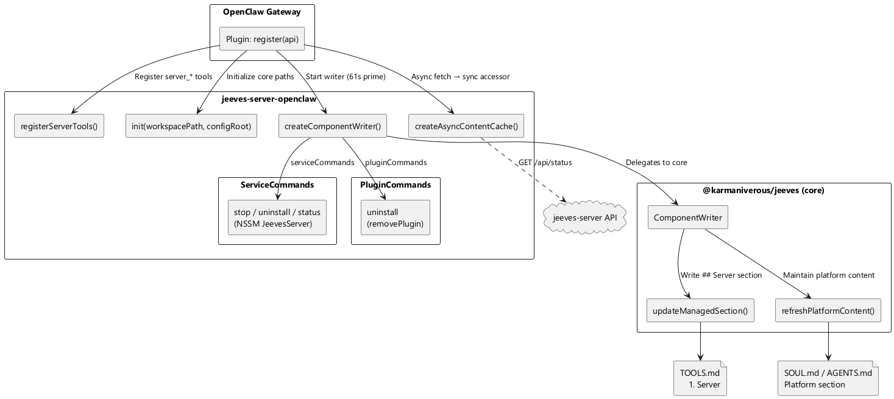

# OpenClaw Integration Guide

## Architecture

The plugin integrates with the Jeeves platform via `@karmaniverous/jeeves` (the shared core library). On startup it initializes the core, registers server tools, and starts a `ComponentWriter` that manages the `## Server` section in TOOLS.md.



## Installation

```bash
npx @karmaniverous/jeeves-server-openclaw install
```

This copies the plugin to `~/.openclaw/extensions/` and patches `openclaw.json`.
Restart the OpenClaw gateway after installing.

## Configuration

### Server Config

Add a `_plugin` key to the server's `keys` config:

```json
{
  "keys": {
    "_internal": "your-internal-seed",
    "_plugin": "hex-seed-for-openclaw-plugin"
  }
}
```

The `_plugin` key must be unscoped (no scope restrictions) — this is enforced by the Zod schema.

### OpenClaw Config

In `openclaw.json`, configure the plugin entry:

```json
{
  "plugins": {
    "entries": {
      "jeeves-server-openclaw": {
        "enabled": true,
        "config": {
          "apiUrl": "http://127.0.0.1:1934",
          "pluginKey": "same-hex-seed-as-server-_plugin-key",
          "configRoot": "j:/config",
          "publicUrl": "https://jeeves.example.com"
        }
      }
    }
  }
}
```

| Config field | Required | Default | Description |
|-------------|----------|---------|-------------|
| `apiUrl` | No | `http://127.0.0.1:1934` | jeeves-server API base URL |
| `pluginKey` | No | — | Server `_plugin` key seed (for authenticated API calls) |
| `configRoot` | No | `j:/config` | Platform config root directory. Core derives component config dirs from this path. |
| `publicUrl` | No | — | Public base URL (e.g. `https://jeeves.example.com`). When set, all URLs returned by tools are rewritten to use this host instead of `apiUrl`. |

## Tools

### Server Tools

| Tool | Purpose |
|------|---------|
| `server_status` | Server health: version, uptime, port, Chrome availability, export formats, auth info |
| `server_browse` | Get file/directory metadata and listings |
| `server_link_info` | Query available link types for a path |
| `server_drives` | List available root drives/labels |
| `server_share` | Generate share links with optional expiry, depth, insider audience, and outsider policy enforcement |
| `server_export` | Trigger export (PDF, DOCX, SVG, PNG, ZIP) |
| `server_export_cache_clear` | Clear export and diagram caches for a path |
| `server_file_write` | Overwrite file content (insider-only) |
| `server_file_mutate` | Apply structured mutations to `.md` files: edit-block, delete-block, insert-block, edit-cell, toggle-checkbox (insider-only) |
| `server_rotate_key` | Rotate the authenticated insider's API key |
| `server_auth_status` | Check current authentication status (no auth required) |
| `server_event_status` | Query event gateway schemas and recent event log entries |
| `server_config` | Query resolved server configuration (supports JSONPath) |
| `server_config_apply` | Apply a configuration patch to the running server |
| `server_service` | Manage the system service (install, uninstall, start, stop, restart, status) |

### OAuth Tools

| Tool | Purpose |
|------|---------|
| `oauth_authorize` | Initiate OAuth2 authorization flow (returns auth URL for user to open) |
| `oauth_status` | Check credential existence and expiry for a provider/account |
| `oauth_token` | Retrieve a valid access token (auto-refreshes if expired) |

## TOOLS.md Injection

The plugin uses `@karmaniverous/jeeves` core's `ComponentWriter` to manage the `## Server` section in TOOLS.md. The writer runs on a 61-second prime interval. Core handles file locking, version stamps, section ordering, and platform content maintenance (SOUL.md, AGENTS.md).

The server menu content (export formats, diagrams, event schemas, insider count) is fetched asynchronously from the server's `/status` endpoint via `createAsyncContentCache()`, bridging the sync `generateToolsContent()` interface. Per plugin isolation (#128), the plugin queries only the server — never watcher or runner directly.

## Uninstalling

```bash
npx @karmaniverous/jeeves-server-openclaw uninstall
```

This removes the plugin from extensions, cleans up `openclaw.json`, and removes the `## Server` section from `TOOLS.md`.
