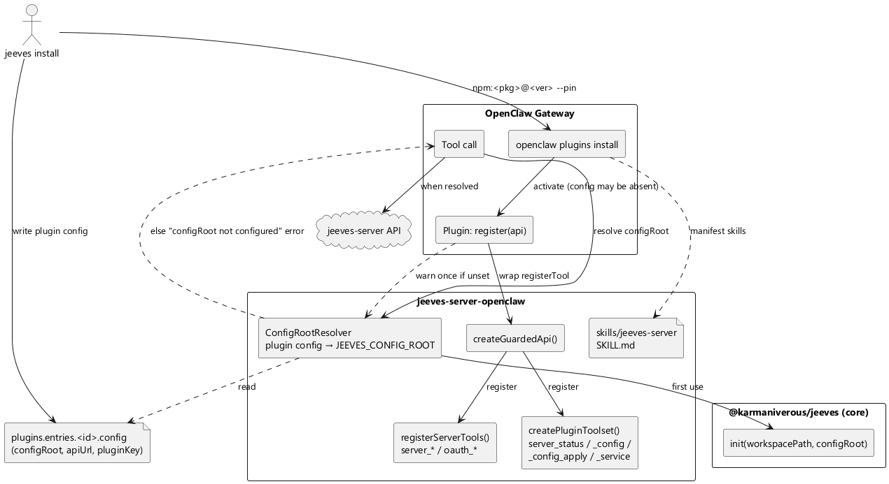

# OpenClaw Integration Guide

## Architecture

The plugin is a standard OpenClaw plugin built on `@karmaniverous/jeeves` (the shared core library). `register()` only registers tools: it reads no config, starts no timers and writes no workspace files. It ships its guidance as a skill (`openclaw.plugin.json` `skills`). Live server state comes from `server_status`.



## Installation

```bash
npm install -g @karmaniverous/jeeves
jeeves install server --config-root /path/to/config
```

`jeeves install` runs `openclaw plugins install npm:@karmaniverous/jeeves-server-openclaw@<version> --pin --accept-capabilities --force`, writes `plugins.entries.jeeves-server-openclaw.config` (`configRoot`, `apiUrl`, and a `pluginKey` kept equal to the server's `keys._plugin`) and removes any legacy `extensions/jeeves-server-openclaw` copy. Restart the OpenClaw gateway afterwards. `jeeves update server` upgrades the plugin.

## Configuration

### Server Config

Add a `_plugin` key to the server's `keys` config:

```json
{
  "keys": {
    "_internal": "your-internal-seed",
    "_plugin": "hex-seed-for-openclaw-plugin"
  }
}
```

The `_plugin` key must be unscoped (no scope restrictions) — this is enforced by the Zod schema.

### OpenClaw Config

In `openclaw.json`, configure the plugin entry:

```json
{
  "plugins": {
    "entries": {
      "jeeves-server-openclaw": {
        "enabled": true,
        "config": {
          "apiUrl": "http://127.0.0.1:1934",
          "pluginKey": "same-hex-seed-as-server-_plugin-key",
          "configRoot": "/path/to/config"
        }
      }
    }
  }
}
```

| Config field | Required | Default | Description |
| --- | --- | --- | --- |
| `apiUrl` | No | `http://127.0.0.1:1934` | jeeves-server API base URL |
| `pluginKey` | No | — | Server `_plugin` key seed (for authenticated API calls) |
| `configRoot` | For tools | — | Platform config root directory. Core derives component config dirs from this path. Set via plugin config or `JEEVES_CONFIG_ROOT` env var. |

### Lazy `configRoot`

With a running gateway, `openclaw plugins install` activates the plugin before `jeeves install` writes its config, so the plugin never needs `configRoot` to load:

- Registration always succeeds. When neither the plugin config nor `JEEVES_CONFIG_ROOT` provides `configRoot`, the plugin logs one warning.
- `configRoot` is resolved (plugin config, then `JEEVES_CONFIG_ROOT`) each time a tool runs, and core `init()` runs on first use.
- Until it is set, every tool returns: `configRoot not configured — set plugins.entries.jeeves-server-openclaw.config.configRoot in the plugin config or the JEEVES_CONFIG_ROOT environment variable`.

The plugin reads `publicUrl` from the server’s own config at `{configRoot}/jeeves-server/config.json`. See the [Setup guide](../../service/guides/setup.md#public-url) for details.

## Tools

### Server Tools

| Tool | Purpose |
| --- | --- |
| `server_status` | Server health: version, uptime, port, Chrome availability, export formats, auth info |
| `server_browse` | Get file/directory metadata and listings |
| `server_link_info` | Query available link types for a path |
| `server_drives` | List available root drives/labels |
| `server_share` | Generate share links with optional expiry, depth, insider audience, and outsider policy enforcement |
| `server_export` | Trigger export (PDF, DOCX, SVG, PNG, ZIP) |
| `server_export_cache_clear` | Clear export and diagram caches for a path |
| `server_file_write` | Overwrite file content (insider-only) |
| `server_file_mutate` | Apply structured mutations to `.md` files: edit-block, delete-block, insert-block, edit-cell, toggle-checkbox (insider-only) |
| `server_rotate_key` | Rotate the authenticated insider's API key |
| `server_auth_status` | Check current authentication status (no auth required) |
| `server_event_status` | Query event gateway schemas and recent event log entries |
| `server_resolve_path` | Convert an absolute filesystem path to a server browse path and optional public URL |
| `server_config` | Query resolved server configuration (supports JSONPath) |
| `server_config_apply` | Apply a configuration patch to the running server |
| `server_service` | Manage the system service (install, uninstall, start, stop, restart, status) |

### OAuth Tools

| Tool | Purpose |
| --- | --- |
| `oauth_authorize` | Initiate OAuth2 authorization flow (returns auth URL for user to open) |
| `oauth_status` | Check credential existence and expiry for a provider/account |
| `oauth_token` | Retrieve a valid access token (auto-refreshes if expired) |

## Skill and Live State

The plugin writes nothing to TOOLS.md or any other workspace file. Guidance ships in the `jeeves-server` skill (declared in `openclaw.plugin.json`, with `name`/`description` frontmatter checked by a test). For live capabilities (export formats, diagram support, event schemas, insider count), call `server_status`.

The plugin registers no conversation hooks, so it needs no `hooks.allowConversationAccess` grant.

## Uninstalling

```bash
jeeves uninstall
```

`jeeves uninstall` removes the Jeeves plugins (use `--dry-run` to preview the `openclaw` commands). To remove only this plugin, run `openclaw plugins uninstall jeeves-server-openclaw`. A `## Server` section left in TOOLS.md by an older version is no longer maintained; `jeeves uninstall` strips the legacy TOOLS.md block.
