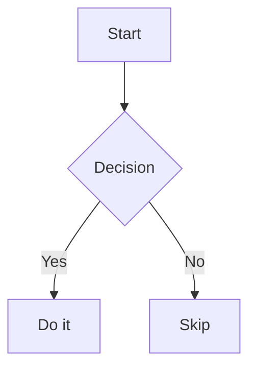
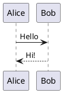

# Exporting & Downloads

Jeeves Server can export files as PDF, DOCX, ZIP, or tar — turning Markdown into business-ready documents with one click.

## Export Types

| Format | Available For | How It Works |
|--------|--------------|--------------|
| **PDF** | Markdown, Mermaid, PlantUML | Puppeteer (Markdown) or diagram renderer (Mermaid/PlantUML) |
| **DOCX** | Markdown files | HTML converted via `@turbodocx/html-to-docx` |
| **SVG** | Mermaid (`.mmd`), PlantUML (`.puml`, `.pu`, `.plantuml`) | Rendered via Mermaid CLI or PlantUML jar/server |
| **PNG** | Mermaid, PlantUML | Rendered via Mermaid CLI or PlantUML jar/server |
| **EPS** | PlantUML (jar only) | Vector export via PlantUML jar |
| **ZIP** | Directories | Entire directory tree compressed via [`archiver`](https://github.com/archiverjs/node-archiver) |
| **Tar** | Directories | Uncompressed tar archive via [`archiver`](https://github.com/archiverjs/node-archiver) |
| **Raw** | Any file | Direct file download |

## Using Exports

### From the UI

The **Download dropdown** (⬇️ icon) in the header shows available export options based on the current file type. Click an option and the file downloads directly — a spinner shows during generation, replaced by a checkmark on completion.

### Via URL Parameters

Append to any file URL:

```
# PDF export
/browse/d/docs/design.md?export=pdf

# DOCX export
/browse/d/docs/design.md?export=docx

# Raw file download
/browse/d/docs/design.md?raw=1
```

These work with both insider keys (`?key=<insider-key>&export=pdf`) and outsider share links.

### Programmatic Access

```bash
# Download PDF via curl
curl -o design.pdf "https://jeeves.example.com/path/d/docs/design.md?key=<key>&export=pdf"

# Download DOCX
curl -o design.docx "https://jeeves.example.com/path/d/docs/design.md?key=<key>&export=docx"

# Download raw file
curl -o design.md "https://jeeves.example.com/path/d/docs/design.md?key=<key>&raw=1"
```

## PDF Export

PDF generation uses [**Puppeteer**](https://github.com/puppeteer/puppeteer) with your installed Chrome/Chromium. The server:

1. Launches headless Chrome
2. Loads the rendered markdown page (authenticating with the `_internal` key)
3. Prints to PDF with print-quality settings
4. Returns the PDF as a download

### Requirements

- **Chrome/Chromium** must be installed on the server
- **`chromePath`** must point to the executable in `your config file`
- **`_internal` key** must be configured (Puppeteer uses it to authenticate)

```json
{
  "chromePath": "C:\\Program Files\\Google\\Chrome\\Application\\chrome.exe",
  "keys": {
    "_internal": "random-seed-string"
  }
}
```

### What you see is what you get

PDFs render from the same HTML as the browser view, but:
- **Prose width setting is ignored** — exports always use full width
- **Dark mode is ignored** — exports always render in light mode
- **TOC sidebar is excluded** — the document stands alone
- **Code blocks retain syntax highlighting** — colors print correctly

### Troubleshooting

**"Export failed" error:**
- Verify `chromePath` points to a valid Chrome/Chromium executable
- Ensure the `_internal` key is configured in `keys`
- Check server logs for Puppeteer errors

**Blank or login page in PDF:**
- The `_internal` key's derived insider key must be valid
- Verify with: `curl -s "http://localhost:<port>/insider-key" -H "X-API-Key: <_internal-seed>"`

**Timeout on large documents:**
- Large markdown files with many code blocks or diagrams take longer to render
- The server has a default timeout; very large documents may need optimization

## DOCX Export

DOCX generation converts the rendered HTML to a Word document using [`@turbodocx/html-to-docx`](https://github.com/nickmessing/turbodocx). This happens server-side without Chrome.

DOCX exports:
- Preserve headings, tables, lists, and basic formatting
- Include code blocks (without syntax highlighting colors)
- Embed images as inline content
- Work independently of the `_internal` key (no Puppeteer needed)

## Mermaid Export

Mermaid diagrams (`.mmd` files) can be exported as SVG, PNG, or PDF via the [Mermaid CLI](https://github.com/mermaid-js/mermaid-cli) (`mmdc`).

### Requirements

Mermaid CLI is bundled as a direct dependency (`@mermaid-js/mermaid-cli`) — no separate installation or configuration needed. Chrome/Chromium is required for rendering.

### Export endpoint

```
GET /api/mermaid-export/<path>?format=svg|png|pdf
```

## PlantUML Export

PlantUML files (`.puml`, `.pu`, `.plantuml`) can be exported as SVG, PNG, PDF, or EPS.

### Rendering pipeline

PlantUML uses a **fallback rendering pipeline** — each method is tried in order until one succeeds:

1. **Local Java jar** — fastest, supports `!include` directives for complex diagrams with shared libraries. Requires Java and the PlantUML jar.
2. **Configured PlantUML servers** — self-hosted or private PlantUML server instances, tried in order.
3. **Public community server** (`plantuml.com`) — always appended as the last resort. Cannot resolve `!include` directives.

### Configuration

```json
{
  "plantuml": {
    "jarPath": "/opt/plantuml/plantuml.jar",
    "javaPath": "/usr/bin/java",
    "servers": ["https://internal.plantuml.example.com/plantuml"]
  }
}
```

If `plantuml` is omitted entirely, only the public community server is used.

### Export formats

| Format | Jar | Server |
|--------|-----|--------|
| SVG | ✅ | ✅ |
| PNG | ✅ | ✅ |
| PDF | ✅ | ❌ |
| EPS | ✅ | ❌ |

### Export endpoint

```
GET /api/plantuml-export/<path>?format=svg|png|pdf|eps
```

### `!include` support

Only the **local jar** method resolves `!include` directives. If your diagrams reference shared PlantUML libraries (e.g., AWS icons, company style files), you must configure `jarPath`. The jar runs with `cwd` set to the diagram's parent directory, so relative includes resolve naturally.

## Embedded Diagrams in Markdown

Markdown files can contain **inline diagram source** in fenced code blocks. Following the [GitHub convention](https://github.blog/2022-02-14-include-diagrams-markdown-files-mermaid/), code blocks tagged `mermaid` or `plantuml` (also `puml`) are rendered as inline SVG diagrams when the page is displayed.

````markdown



````

### How it works

Diagram blocks are detected during markdown parsing, replaced with placeholders, and rendered server-side after HTML generation:
- **Mermaid** — rendered via Mermaid CLI (`mmdc`) to SVG
- **PlantUML** — rendered via the same fallback pipeline as `.puml` files (jar → servers → community)

If rendering fails, the source code is displayed with a small error label.

### Showing source instead of rendering

To display diagram source as a code block (without rendering), use a different language hint:

````markdown
```text
graph TD
    A --> B
```
````

### PDF/DOCX export

Embedded diagrams appear in PDF and DOCX exports as rendered SVGs — what you see in the browser is what you get in the export.

## Directory Archive Export

Directories can be downloaded as ZIP or tar archives. The download dropdown in the header shows both options when viewing a directory.

### Size limit

The `maxZipSizeMb` config setting (default: 100 MB) prevents accidentally archiving enormous directories:

```
maxZipSizeMb: 100,  // Refuse archive for directories larger than this
```

When the total directory size exceeds this limit, the archive options are disabled with a message explaining why.

### What's included

The archive contains the entire directory tree — all files and subdirectories. No files are excluded.

## Export for Outsiders

Outsiders (people using share links) can also export files:
- **PDF and DOCX** exports work on shared markdown files
- **Raw download** works on any shared file
- **ZIP/Tar** is not available — directory archive exports require insider access

The share link's authentication covers the export — no additional credentials needed.
