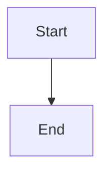
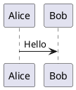

# User Guide

Welcome! This guide covers everything you need to know about using the file browser and document server.

Your experience depends on how you access the server:

- **[Insiders](#insider-experience)** — Authenticated users with a Google or email login. Full access to browsing, [search](#search), [sharing](#sharing), [exports](#downloads--exports), and [key management](#key-rotation).
- **[Outsiders](#outsider-experience)** — Recipients of a share link. Read-only access to the specific file or directory that was shared with you, plus [exports](#downloads--exports).

---

## Signing In

You can sign in using one of the available methods shown on the login page:

- **Google** — Click the Google button to authenticate with your Google account.
- **Email (Magic Link)** — Enter your email address and check your inbox for a one-time login link. The link expires after 10 minutes and can only be used once.

Your administrator determines which sign-in methods are available. If you only see a message about an API key, contact your administrator for access.

After signing in, you'll be redirected to the page you were originally trying to reach.

---

## Insider Experience

Insiders have full authenticated access to the server. After [signing in](#signing-in), you can browse files, search documents, create share links, and export content.

### Browsing Files

The **file browser** is your home screen. Navigate through directories by clicking folder names. Click any file to view its contents. Use the breadcrumb trail in the header to navigate back up.

### Supported File Types

| Type | Extensions | Rendering |
|------|-----------|-----------|
| **Markdown** | `.md` | Full formatting, [table of contents](#table-of-contents), embedded [diagrams](#diagrams) |
| **Code** | `.ts`, `.js`, `.py`, `.json`, etc. | Syntax highlighting with line numbers, copy and word-wrap toggle |
| **CSV** | `.csv` | Formatted tables |
| **SVG** | `.svg` | Interactive pan-and-zoom viewer |
| **Mermaid diagrams** | `.mmd` | Rendered flowcharts, sequence diagrams, Gantt charts, etc. |
| **PlantUML diagrams** | `.puml`, `.plantuml`, `.pu` | Rendered UML, architecture, and component diagrams |
| **Images** | `.png`, `.jpg`, `.gif`, `.webp` | Displayed inline |
| **Other files** | — | Available for [download](#downloads--exports) |

### View Modes

For files that support rendering (Markdown, CSV, SVG, diagrams), you can toggle between:

- **Rendered** — Formatted output with full styling.
- **Raw** — Source text with syntax highlighting.

### Code Block Toolbar

All code blocks (in both rendered and raw views) display a hover toolbar with two controls:

- **Copy** — Copies the block content to clipboard. Shows a green checkmark on success.
- **Word Wrap** — Toggles line wrapping on/off. Plain text files (`.txt`, `.log`, `.csv`) default to wrap on; code files default to wrap off.

Use the tab bar below the header to switch views.

### Table of Contents

Markdown files with headings display a **table of contents** sidebar. On mobile, tap the TOC button in the tab bar to toggle it. Click any heading in the TOC to scroll directly to that section.

### Prose Width

Adjust the reading width of rendered Markdown using the width toggle in the tab bar. Three settings are available: narrow, medium, and wide.

### Diagrams

Diagrams can appear as standalone files or embedded in Markdown documents.

**Standalone diagrams** (`.mmd`, `.puml`) are rendered with an interactive viewer that supports pan and zoom.

**Embedded diagrams** are written in fenced code blocks within Markdown files:

````markdown



````

Both Mermaid and PlantUML are supported. Embedded diagrams are rendered inline alongside the surrounding text.

### Search

Use the **search** button in the header (or press `Ctrl+K` / `Cmd+K`) to search across all indexed documents. Results are ranked by relevance and show matching text snippets.

Search supports filters for domains, authors, and other metadata when available. Search is only available to insiders.

### Sharing

Insiders can create links to share files or directories with [outsiders](#outsider-experience) — people who don't have an account.

#### Creating Share Links

1. Click the **link** icon in the header bar.
2. Configure sharing options:
   - **Expiry** — How long the link remains valid.
   - **Depth** — For directories, how many levels deep the share extends.
   - **Include directories** — Whether subdirectory listings are accessible.
3. Copy the generated link.

Share links are cryptographically signed and cannot be guessed. Each link is scoped to the specific path and sharing options you selected.

#### Share Link Scope

Your administrator may configure an **outsider policy** that restricts which paths can be shared externally. If a path is blocked by policy, the share dialog will indicate this.

### Inline Editing

Insiders can edit Markdown and text files directly in the browser:

1. Switch to the **Raw** tab.
2. Click the **Edit** button.
3. Make your changes in the code editor.
4. Press `Ctrl+Enter` to save, or click Cancel to discard.

Undo/redo buttons appear in the tab bar after edits are saved.

### Key Rotation

Your access key is used to generate [share links](#sharing). If you need to invalidate all your existing share links (e.g., if a link was shared with the wrong person), you can **rotate your key** from the account menu.

> ⚠️ Key rotation is permanent and cannot be undone. All share links you've previously created will stop working.

---

## Outsider Experience

Outsiders access the server through a [share link](#sharing) created by an insider. No sign-in is required.

### What You Can Do

- **View** the shared file or directory (depending on the link's [scope](#share-link-scope)).
- **Navigate** within shared directories (if directory listing was enabled in the share).
- **Download** the shared content — see [Downloads & Exports](#downloads--exports).
- **Toggle** between light and dark themes.

### What You Can't Do

- [Search](#search) across documents.
- [Edit](#inline-editing) files.
- Create [share links](#sharing) of your own.
- Access any path outside the scope of your link.

### Link Expiry

Share links may have an expiry date set by the insider who created them. Expired links will no longer grant access. If you need continued access, ask the person who shared the link to create a new one.

---

## Downloads & Exports

Click the **download** icon in the header to access export options. Available formats depend on the file type:

| Source | Available Exports |
|--------|------------------|
| Markdown files | PDF, DOCX, Raw download |
| Directories | ZIP archive |
| Diagrams (Mermaid, PlantUML) | SVG, PNG |
| Any file | Raw download |

Both [insiders](#insider-experience) and [outsiders](#outsider-experience) can download and export content they have access to.

---

## Keyboard Shortcuts

| Shortcut | Action |
|---|---|
| `Ctrl+K` / `Cmd+K` | Open [search](#search) (insiders only) |
| `Ctrl+Enter` | Save when [editing](#inline-editing) |

---

## Getting Help

If you need help with access, permissions, or configuration, contact your administrator or your AI assistant. Your assistant can help with tasks like setting up integrations, managing user access, and troubleshooting.

### Further Reading

These guides are written for server administrators but may be useful as reference:

- [Setup & Configuration](https://docs.karmanivero.us/jeeves-server/documents/Service_Guides.Setup___Configuration.html) — Installation, auth modes, JSON config, named scopes, and config reference.
- [Insiders, Outsiders & Sharing](https://docs.karmanivero.us/jeeves-server/documents/Service_Guides.Insiders__Outsiders___Sharing.html) — The access model, HMAC key derivation, expiring links, and key rotation.
- [Exporting & Downloads](https://docs.karmanivero.us/jeeves-server/documents/Service_Guides.Exporting___Downloads.html) — PDF, DOCX, SVG, PNG, and ZIP export.
- [Event Gateway](https://docs.karmanivero.us/jeeves-server/documents/Service_Guides.Event_Gateway.html) — Webhook receiving, JSON Schema matching, and durable queue processing.
- [Deployment](https://docs.karmanivero.us/jeeves-server/documents/Service_Guides.Deployment.html) — Running as a service, reverse proxy setup, HTTPS, and updates.
- [API & Integration](https://docs.karmanivero.us/jeeves-server/documents/Service_Guides.API___Integration.html) — Endpoint reference, share link generation, and AI assistant usage.
