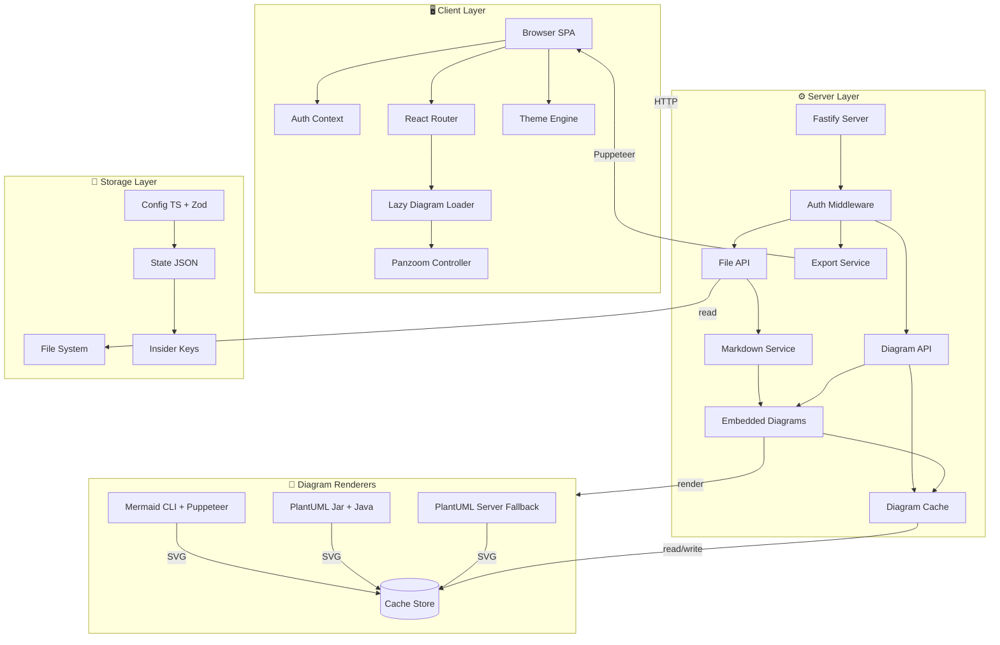
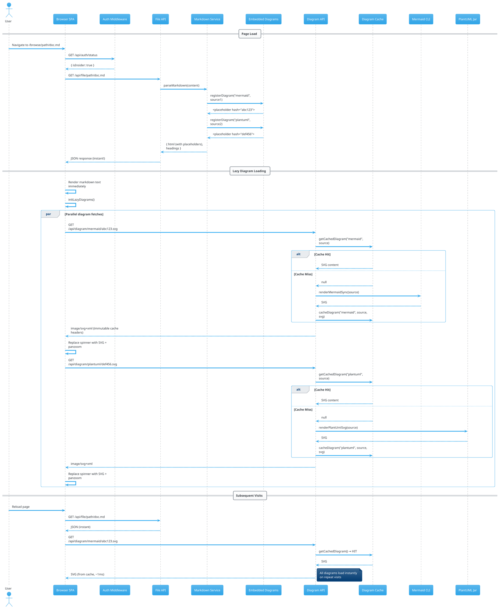
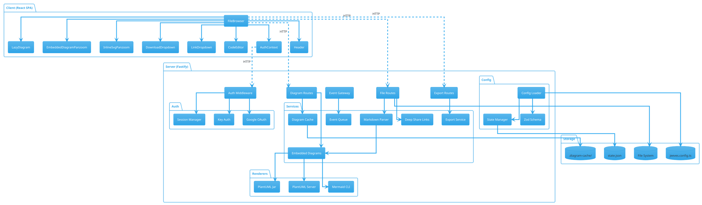
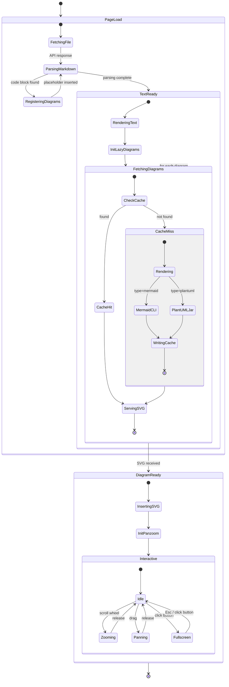

# Lazy Diagram Loading Test

This page tests lazy-loaded embedded diagrams. The text below should appear **instantly** while diagrams render in the background.

## Section 1: Introduction

Lorem ipsum dolor sit amet, consectetur adipiscing elit. Sed do eiusmod tempor incididunt ut labore et dolore magna aliqua. Ut enim ad minim veniam, quis nostrud exercitation ullamco laboris nisi ut aliquip ex ea commodo consequat. Duis aute irure dolor in reprehenderit in voluptate velit esse cillum dolore eu fugiat nulla pariatur.

## Diagram 1: Complex Mermaid Flowchart

## Section 2: More Text

Excepteur sint occaecat cupidatat non proident, sunt in culpa qui officia deserunt mollit anim id est laborum. Sed ut perspiciatis unde omnis iste natus error sit voluptatem accusantium doloremque laudantium, totam rem aperiam, eaque ipsa quae ab illo inventore veritatis et quasi architecto beatae vitae dicta sunt explicabo.

## Diagram 2: Complex PlantUML Sequence

## Section 3: Analysis

The architecture above demonstrates a clean separation between the document rendering pipeline and the diagram rendering pipeline. By decoupling these concerns, we achieve:

1. **Fast time-to-first-byte** — markdown text renders without waiting for diagrams
2. **Parallel rendering** — multiple diagrams render concurrently
3. **Content-addressed caching** — identical diagram source always produces the same cache key
4. **Progressive enhancement** — diagrams appear as they become available

## Diagram 3: PlantUML Component Diagram

## Diagram 4: Mermaid State Diagram

## Section 4: Conclusion

If you're reading this text while diagrams above still show spinners, the lazy loading is working as designed. The text content was delivered without waiting for any diagram rendering. Each diagram loads independently and appears as soon as its SVG is ready.

On subsequent page loads, all diagrams should appear nearly instantly thanks to the content-addressed cache.
