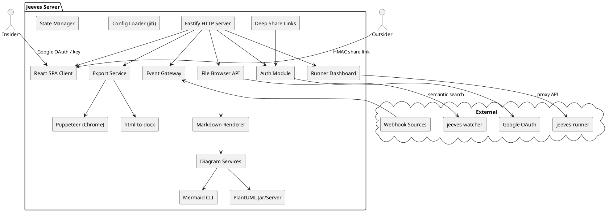

# jeeves-server spec

## Overview

Jeeves Server is a **self-hosted file browser, document viewer, and webhook gateway** that turns AI-authored Markdown into business-ready deliverables. It bridges the gap between Markdown — the native authoring format for AI collaboration — and the polished PDFs, Word documents, and browser-rendered views that business stakeholders expect.

**Repo:** [github.com/karmaniverous/jeeves-server](https://github.com/karmaniverous/jeeves-server)
**npm:** `@karmaniverous/jeeves-server`
**License:** MIT
**Default port:** 1934
**Prod:** `C:\jeeves-server` (NSSM service `JeevesServer`)

> **Why 1934?** Jeeves services use ports in the 1930s decade, a nod to the era of P.G. Wodehouse's Jeeves stories. 1934 is the publication year of *Thank You, Jeeves*, the first full-length Jeeves novel. Port assignments: jeeves-server (1934), jeeves-watcher (1936), jeeves-runner (1937).
**Domain:** `jeeves.johngalt.id`

### Core Capabilities

- **File browsing** — Navigate drives and directories through a modern React UI
- **Markdown rendering** — Beautiful HTML with TOC, syntax highlighting, and embedded diagrams
- **PDF & DOCX export** — One-click conversion via Puppeteer and html-to-docx
- **Secure sharing** — HMAC-based expiring share links with insider/outsider access model
- **Event gateway** — Durable webhook receiver with JSON Schema validation and command dispatch
- **Runner dashboard** — Web UI for monitoring and controlling jeeves-runner scheduled jobs
- **Zero CDN dependencies** — All assets served locally

### Design Philosophy

- **Schema-first** — Zod schema is the single source of truth for configuration
- **Config is immutable at runtime** — Mutable state lives in `state.json`
- **Zero trust** — Every request is authenticated; keys are derived, never stored in URLs
- **Platform-agnostic** — Runs on Windows and Linux with a platform abstraction layer

## Vision

A self-hosted publishing and integration hub for AI-assisted workflows. The server is the bridge between the laboratory and the boardroom: AI assistants author Markdown, jeeves-server publishes it as polished web views, PDFs, and Word documents with secure sharing. The event gateway and runner dashboard make it a natural integration hub for automation. Future direction includes deeper integration with agent frameworks via an OpenClaw plugin.

## Current Version (2.9.3)

### Architecture

#### Tech Stack

| Layer | Technology |
|-------|-----------|
| **Server** | Fastify 5 (TypeScript), Node.js ≥ 18 |
| **Client** | React 19 SPA, React Router, Vite |
| **Styling** | Tailwind CSS v4, `@tailwindcss/typography`, Radix UI primitives |
| **Icons** | Lucide (served locally) |
| **Build** | `tsc` (server) + Vite (client) |
| **Config** | Zod 4 schema validation, jiti for runtime TS loading |
| **PDF Export** | Puppeteer-core (headless Chrome) |
| **DOCX Export** | @turbodocx/html-to-docx |
| **Markdown** | marked |
| **Diagrams** | Mermaid CLI, PlantUML (jar + server fallback) |
| **Events** | ajv (JSON Schema), @karmaniverous/jsonmap |

#### System Components



#### Server Entry Point

The server starts in `src/server.ts`:

1. Loads config via `getConfig()` (jiti-powered TS config loader)
2. Registers Fastify plugins (`@fastify/cookie`, `@fastify/static`)
3. Adds `X-Robots-Tag: noindex, nofollow` to all responses
4. Registers route plugins in order: static → health → auth → keys → event → API → path
5. Serves the React SPA at `/browse/*` with SPA fallback
6. Initializes diagram and export caches
7. Starts the event queue processor
8. Listens on `0.0.0.0:<port>`

#### File Layout

```
jeeves-server/
├── jeeves.config.ts          # Runtime config (gitignored, secrets)
├── jeeves.config.template.ts # Config template (committed)
├── state.json                # Mutable runtime state (gitignored)
├── src/
│   ├── server.ts             # Entry point
│   ├── config/
│   │   ├── schema.ts         # Zod schema (source of truth)
│   │   ├── index.ts          # Config loader
│   │   ├── resolve.ts        # Config resolution (keys, insiders)
│   │   └── types.ts          # RuntimeConfig, ResolvedInsider, etc.
│   ├── auth/
│   │   ├── resolve.ts        # Unified auth resolution
│   │   ├── keys.ts           # Key verification, scope matching
│   │   ├── google.ts         # Google OAuth flow
│   │   └── session.ts        # Session cookie sign/verify
│   ├── routes/
│   │   ├── api/              # API routes (auth middleware applied here)
│   │   │   ├── index.ts      # Composes all API sub-routes
│   │   │   ├── middleware.ts  # preHandler auth hook
│   │   │   ├── auth-status.ts
│   │   │   ├── diagrams.ts
│   │   │   ├── directory.ts
│   │   │   ├── drives.ts
│   │   │   ├── export.ts
│   │   │   ├── fileContent.ts
│   │   │   ├── raw.ts
│   │   │   ├── runner.ts     # Runner proxy routes
│   │   │   ├── search.ts
│   │   │   └── sharing.ts
│   │   ├── auth.ts           # Google OAuth routes
│   │   ├── event.ts          # POST /event webhook handler
│   │   ├── health.ts         # GET /health
│   │   ├── keys.ts           # GET /insider-key, GET /key
│   │   └── static.ts         # Static asset routes
│   ├── services/
│   │   ├── markdown.ts       # Markdown → HTML with TOC
│   │   ├── embeddedDiagrams.ts # Inline mermaid/plantuml rendering
│   │   ├── diagramCache.ts   # Content-addressed diagram cache
│   │   ├── deepShareLinks.ts # Link rewriting for deep shares
│   │   ├── export.ts         # PDF/DOCX export orchestration
│   │   ├── exportCache.ts    # Export result caching
│   │   ├── eventQueue.ts     # Durable JSONL event queue
│   │   ├── eventLog.ts       # Event logging with auto-purge
│   │   ├── mermaid.ts        # Mermaid CLI wrapper
│   │   ├── plantuml.ts       # PlantUML jar/server pipeline
│   │   └── puppeteer.ts      # Chrome launcher for PDF
│   ├── util/
│   │   ├── crypto.ts         # HMAC key derivation
│   │   ├── platform.ts       # Windows/Linux path abstraction
│   │   ├── breadcrumbs.ts    # Breadcrumb generation
│   │   ├── fileDetection.ts  # Text vs binary detection
│   │   ├── formatters.ts     # Relative time formatting
│   │   └── state.ts          # state.json read/write
│   └── types/
│       ├── fastify.d.ts      # Request augmentation
│       ├── jsonmap.d.ts
│       └── plantuml-encoder.d.ts
├── client/
│   ├── src/
│   │   ├── main.tsx          # React entry
│   │   ├── App.tsx           # Router setup
│   │   ├── pages/            # FileBrowser, FileViewer, About, Home, Runner, RunnerJob
│   │   ├── components/       # Header, dropdowns, viewers, StatusPill, StatsBar, JobTable, RunHistory
│   │   ├── hooks/            # useFileBrowser, useFileData, useShareSettings, useTopBar
│   │   └── lib/              # api.ts, auth.tsx, theme.ts, runner-api.ts, utils.ts
│   └── package.json
├── content/                  # Pinned content (privacy.md, terms.md)
├── guides/                   # User-facing documentation
└── dist/                     # Compiled output (gitignored)
```

### Authentication & Authorization

#### Auth Flow

```plantuml
@startuml
skinparam shadowing false

start
:Request arrives;

if (URL has ?key= parameter?) then (yes)
  :Derive key via HMAC-SHA256;
  if (Key matches insider seed?) then (yes)
    :→ **Insider** access;
    stop
  elseif (Key matches outsider path key?) then (yes)
    if (Has expiry param?) then (yes)
      if (Expired?) then (yes)
        :→ **401 Unauthorized**;
        stop
      else (no)
        :→ **Outsider** access;
        stop
      endif
    else (no)
      :→ **Outsider** access;
      stop
    endif
  else (no match)
    :→ **401 Unauthorized**;
    stop
  endif
else (no)
  if (Session cookie present?) then (yes)
    :Verify HMAC-signed session;
    if (Email in insiders map?) then (yes)
      :→ **Insider** access;
      stop
    else (no)
      :→ **401 Unauthorized**;
      stop
    endif
  else (no)
    :→ **401 Unauthorized**;
    stop
  endif
endif
@enduml
```



#### Auth Modes

Configured via `auth.modes` — an ordered array of `'google'` and/or `'keys'`:

| Mode | Mechanism | Best For |
|------|-----------|----------|
| `'google'` | Google OAuth 2.0 → session cookie | Browser-based team access |
| `'keys'` | `?key=<derived-key>` URL parameter | Bots, scripts, headless access |

When both modes are active, they're checked in the configured order. A logged-in insider visiting an outsider share link is upgraded to insider access automatically.

#### Insiders

Insiders are authenticated users with browsing privileges. Defined in the `insiders` config map keyed by email address.

**Scope formats:**

```typescript
// Full access (no scopes)
'alice@example.com': {}

// Allow-only (string array)
'contractor@example.com': { scopes: ['/d/projects/client-x/*'] }

// Allow + deny (object)
'team@example.com': {
  scopes: {
    allow: ['/d/*'],
    deny: ['/d/secrets/*', '/d/.private/*'],
  },
}

// Deny-only (everything except exclusions)
'almost-full@example.com': {
  scopes: { deny: ['/d/hr/*'] },
}
```

**Scope semantics:**
- Path must match ≥1 allow pattern AND match 0 deny patterns
- Omitting `allow` = implicit `['/**']`
- Omitting scopes entirely = unrestricted
- Glob matching via `picomatch`

#### Named Machine Keys

Defined in the `keys` config map:

```typescript
keys: {
  primary: 'hex-seed-string',                              // Unscoped
  'webhook-notion': { key: 'seed', scopes: ['/event'] },   // Scoped
  _internal: 'seed-for-puppeteer',                          // Reserved
}
```

- Seeds are configured; actual URL keys are derived via `HMAC-SHA256(seed, "insider")`
- `_internal` is reserved for Puppeteer PDF/DOCX export auth — must be unscoped (enforced by Zod)

#### Key Derivation

All keys are derived from seeds using HMAC-SHA256, truncated to 32 hex characters:

| Key Type | Derivation | Grants |
|----------|-----------|--------|
| Insider key | `HMAC-SHA256(seed, "insider")` | Full access within scopes |
| Outsider key | `HMAC-SHA256(seed, normalizedPath)` | Single path access |
| Expiring outsider | `HMAC-SHA256(seed, path + "\|" + expiry)` | Single path, time-limited |
| Deep share key | `HMAC-SHA256(seed, path + "\|" + d + "\|" + dirs + "\|" + stack + "\|" + exp)` | Path + depth traversal |

Key verification uses timing-safe comparison to prevent timing attacks.

#### Google OAuth Flow

1. User visits `/api/auth/google` → redirected to Google consent screen
2. Google redirects to `/api/auth/google/callback` with auth code
3. Server exchanges code for tokens, extracts email
4. Email checked against `insiders` map
5. Session cookie set (HMAC-signed with `auth.sessionSecret`)
6. If first login, a key seed is auto-generated and stored in `state.json`

### File Browser

#### Path Resolution

The file browser maps URL paths to filesystem paths through a platform abstraction layer (`src/util/platform.ts`):

**Windows:** Drives auto-discovered (A-Z). URL path `d/docs/design.md` → `D:\docs\design.md`.

**Linux:** Configurable `roots` map (e.g. `{ home: '/home', projects: '/opt/projects' }`). URL path `home/user/docs/file.md` → `/home/user/docs/file.md`. Default: `{ root: '/' }`.

#### Directory Listing

`GET /api/path/:path` returns directory entries sorted (directories first, then alphabetical). Insider scopes filter entries — entries outside scope are hidden. For outsiders, breadcrumbs are trimmed to the share root.

#### File Serving

`GET /api/file/:path` returns file content with type-specific handling:

| File Type | Response `type` | Includes |
|-----------|----------------|----------|
| `.md` | `markdown` | `html`, `headings`, `content` (raw), `fileName` |
| `.mmd` | `mermaid` | `html` (rendered SVG), `content` (source) |
| `.puml/.pu/.plantuml` | `plantuml` | `html` (rendered SVG), `content` (source) |
| `.svg` | `svg` | `content` (raw SVG) |
| Text files | `text` | `content` (raw text) |
| Images | `image` | `fileName` only (client loads via raw URL) |
| Binary | `binary` | `fileName`, `size` |

#### File Writing

`PUT /api/file/:path` — Insider-only endpoint for writing file content.

### Document Rendering

#### Markdown Pipeline

```plantuml
@startuml
skinparam shadowing false

:Raw Markdown;
:Linkify filesystem paths\n(Windows/Linux paths → browse links);
:Parse with **marked**;

fork
  :Extract headings → TOC;
fork again
  :Custom renderer;
  :Heading anchors (id + # link);
  :Image src rewriting\n(relative → /api/raw/);
  :Code block handling;
  if (Language = mermaid?) then (yes)
    :Register diagram placeholder;
  elseif (Language = plantuml/puml?) then (yes)
    :Register diagram placeholder;
  else (code)
    :HTML-escape + lang class;
  endif
end fork

:HTML output with placeholders;

if (render_diagrams=1?) then (yes)
  :Render embedded diagrams\n(Mermaid CLI / PlantUML);
  :Replace placeholders with SVG;
endif

if (Deep share link?) then (yes)
  :Rewrite internal links\n(compute sub-keys for descendants);
endif

:Final HTML;
@enduml
```



**Features:**
- YAML frontmatter detection and rendering (stripped from body, displayed as syntax-highlighted YAML code block above content, with margin separation)
- Filesystem path linkification (Windows paths like `D:\docs\file.md` become clickable browse links, only for paths that exist on disk)
- Heading anchors with `id` and `#` links
- Image rewriting (relative paths → `/api/raw/`)
- Client-side syntax highlighting via highlight.js
- Table of contents sidebar from heading hierarchy

#### Embedded Diagrams

Fenced code blocks tagged `mermaid` or `plantuml`/`puml` render as inline SVG diagrams (GitHub convention). Content-addressed caching in `diagramCachePath`. On render failure, source code displayed with error label. Use `` ```text `` to show source without rendering.

#### PlantUML Rendering Pipeline

Cascading fallback: local Java jar (fastest, supports `!include`) → configured private servers → public `plantuml.com` server (always appended as last resort).

#### Standalone Diagram Files

`.mmd`, `.puml`/`.pu`/`.plantuml`, and `.svg` files render with pan/zoom via Panzoom.

### Export System

| Format | Available For | Mechanism |
|--------|--------------|-----------|
| **PDF** | Markdown | Puppeteer (headless Chrome print) |
| **DOCX** | Markdown | @turbodocx/html-to-docx |
| **SVG/PNG/PDF** | Mermaid, PlantUML | Diagram renderer |
| **EPS** | PlantUML (jar only) | PlantUML jar |
| **ZIP** | Directories | archiver (configurable size limit) |
| **Raw** | Any file | Direct download |

**PDF export:** Launches headless Chrome, loads the page with `_internal` key, prints with light mode and full width (TOC excluded). Requires `chromePath` + `_internal` key.

**DOCX export:** Server-side HTML-to-DOCX via `@turbodocx/html-to-docx`. No Chrome required.

**ZIP export:** Directories as ZIP archives. Size limited by `maxZipSizeMb` (default 100 MB). Insider-only.

**Export caching:** In-memory. Clearable per-file via `DELETE /api/export-cache/:path`.

### Content Links

Pinned content served from `content/` directory (privacy.md, terms.md). `GET /api/content-link/:file` returns a pre-computed deep share URL using `_internal` key (depth=0, dirs=false). Unauthenticated endpoint returning share URLs.

### Share Links

#### Link Types

| Type | URL Shape | Access |
|------|-----------|--------|
| Insider | `/browse/d/file.md?key=<insider-key>` | Full navigation within scopes |
| Outsider (simple) | `/browse/d/file.md?key=<path-key>` | Single path only |
| Outsider (expiring) | `/browse/d/file.md?key=<key>&exp=<timestamp>` | Single path, time-limited |
| Deep share | `/browse/d/file.md?key=<key>&d=2&dirs=0&s=<stack>` | Path + descendant traversal |

#### Deep Share Links

Allow outsiders to follow internal links within rendered documents:
- `d` (depth) — Maximum link-follow depth (0-10). Internal links get computed sub-keys.
- `dirs` — When `1`, directory navigation within scope is allowed.
- `s` (stack) — LZ-string compressed path stack for back-navigation tracking.

Server-side link rewriting computes sub-keys for internal links. External links untouched.

#### Outsider Policy

Global config constraining which paths are eligible for outsider sharing. Enforced by `POST /api/util/share-for` when `enforceOutsiderPolicy: true`.

#### Key Rotation

`POST /api/rotate-key` — Generates new random seed, stored in `state.json`. Invalidates all outsider links generated by that insider. Irreversible.

#### Client-Side Insider Upgrade

When a logged-in insider lands on an outsider share link, the SPA detects insider status via `/api/auth/status` and strips key/depth/stack params.

### Event Gateway

#### Processing Flow

```plantuml
@startuml
skinparam shadowing false

:POST /event?key=<key>;

:Authenticate (scoped key);
if (Key valid for /event?) then (yes)
else (no)
  :→ 401 Unauthorized;
  stop
endif

:Match body against\nconfigured JSON Schemas\n(ajv, first match wins);

if (Match found?) then (yes)
  :Transform body via JsonMap\n(if map configured);
  :Append to JSONL queue\n(logs/event-queue.jsonl);
  :→ { matched: "event-name" };
else (no)
  :Log unmatched event;
  :→ { matched: null }\n(200 OK to prevent retry);
endif

note right
  **Queue Processor** (separate loop):
  1. Read entries sequentially
  2. Spawn cmd with body on stdin
  3. Kill after timeoutMs
  4. Log result to event-log.jsonl
  5. Advance cursor
end note
@enduml
```



**Durable queue:** `logs/event-queue.jsonl` (append-only), `logs/event-queue.cursor` (byte offset). Survives restarts. Sequential, single-threaded processing.

**Event logging:** All events logged to `logs/event-log.jsonl` with auto-purge (configurable `eventLogPurgeMs`, default 30 days).

**Body mapping:** JsonMap (`@karmaniverous/jsonmap`) transforms webhook payloads. `lib` object includes `radash` as `_`.

### Runner Dashboard

Web UI for monitoring and controlling jeeves-runner scheduled jobs. Added in v2.9.0.

**Server:** Proxy API routes at `src/routes/api/runner.ts` forward requests to jeeves-runner (configured via `runnerUrl`). All routes require insider auth. Handles runner-down gracefully.

**Client:** React pages (`Runner`, `RunnerJob`) with components:
- `StatusPill` — Job status indicators with dark mode support
- `StatsBar` — Aggregate job statistics
- `JobTable` — Sortable job listing with auto-refresh
- `RunHistory` — Expandable run output history
- Run-now, enable/disable controls per job

**Navigation:** Activity icon link in header (visible md+, collapses to account menu). Insider-only.

### API Reference

#### Unauthenticated Endpoints

| Method | Path | Description |
|--------|------|-------------|
| GET | `/health` | Health check (200 OK) |
| GET | `/api/readme-link` | Pre-computed README deep share URL |
| GET | `/api/content-link/:file` | Share link for content/*.md files |

#### Key Management (X-API-Key header)

| Method | Path | Description |
|--------|------|-------------|
| GET | `/insider-key` | Derive insider key from seed |
| GET | `/key?path=<path>` | Derive outsider key for a path |

#### Authentication

| Method | Path | Description |
|--------|------|-------------|
| GET | `/api/auth/status` | Auth status check (accepts `path` for outsider verification) |
| GET | `/api/auth/google` | Initiate Google OAuth |
| GET | `/api/auth/google/callback` | Google OAuth callback |

#### File Browser (Cookie or `?key=`)

| Method | Path | Description |
|--------|------|-------------|
| GET | `/api/drives` | List drives/roots |
| GET | `/api/path/:path` | Directory listing |
| GET | `/api/file/:path` | File content (type-aware) |
| PUT | `/api/file/:path` | Write file (insider only) |
| GET | `/api/raw/:path` | Raw file download |

#### Export (Cookie or `?key=`)

| Method | Path | Description |
|--------|------|-------------|
| GET | `/api/export/:path?format=pdf\|docx\|zip` | Export file/directory |
| DELETE | `/api/export-cache/:path` | Clear caches (insider only) |
| GET | `/api/mermaid-export/:path?format=svg\|png\|pdf` | Export Mermaid diagram |
| GET | `/api/plantuml-export/:path?format=svg\|png\|pdf\|eps` | Export PlantUML diagram |

#### Diagrams

| Method | Path | Description |
|--------|------|-------------|
| GET | `/api/diagram/:hash` | Serve cached diagram by content hash |

#### Sharing (Insider only)

| Method | Path | Description |
|--------|------|-------------|
| POST | `/api/share` | Generate outsider share link |
| POST | `/api/rotate-key` | Rotate insider key seed |
| POST | `/api/util/share-for` | Audience-aware share link generation |

#### Search (Insider only)

| Method | Path | Description |
|--------|------|-------------|
| POST | `/api/search` | Semantic search (proxies to jeeves-watcher) |

#### Runner (Insider only)

| Method | Path | Description |
|--------|------|-------------|
| GET | `/api/runner/*` | Proxy to jeeves-runner API |
| POST | `/api/runner/*` | Proxy to jeeves-runner API |

#### Event Gateway

| Method | Path | Description |
|--------|------|-------------|
| POST | `/event` | Webhook receiver (`?key=` scoped to `/event`) |

#### SPA Routes

| Path | Description |
|------|-------------|
| `/` | Redirect to SPA |
| `/browse` | Drive listing |
| `/browse/*` | File/directory view |
| `/runner` | Runner dashboard (job list) |
| `/runner/:jobId` | Runner job detail |

### Configuration

#### `jeeves.config.ts`

TypeScript config loaded at startup via `jiti`. Validated by Zod schema at `src/config/schema.ts`. Gitignored.

| Option | Type | Default | Description |
|--------|------|---------|-------------|
| `port` | `number` | — | Server port |
| `chromePath` | `string` | — | Chrome/Chromium path for Puppeteer |
| `auth.modes` | `('google'\|'keys')[]` | — | Active auth methods (order = priority) |
| `auth.google.clientId` | `string` | — | Google OAuth client ID |
| `auth.google.clientSecret` | `string` | — | Google OAuth client secret |
| `auth.sessionSecret` | `string` | — | Session cookie signing secret |
| `insiders` | `Record<email, InsiderEntry>` | `{}` | Insider users with optional scopes |
| `keys` | `Record<string, string\|KeyEntry>` | `{}` | Named API keys (seed or `{key, scopes}`) |
| `events` | `Record<string, EventConfig>` | `{}` | Event webhook processing rules |
| `eventTimeoutMs` | `number` | `30000` | Default event command timeout |
| `eventLogPurgeMs` | `number` | `2592000000` | Event log retention (30 days) |
| `maxZipSizeMb` | `number` | `100` | Max directory size for ZIP export |
| `roots` | `Record<string, string>` | — | Linux filesystem roots |
| `mermaidCliPath` | `string` | — | Mermaid CLI installation path |
| `plantuml.jarPath` | `string` | — | Local PlantUML jar path |
| `plantuml.javaPath` | `string` | `'java'` | Java binary path |
| `plantuml.servers` | `string[]` | — | Private PlantUML server URLs |
| `diagramCachePath` | `string` | `.diagram-cache` | Diagram cache directory |
| `watcherUrl` | `string` | — | jeeves-watcher URL for semantic search |
| `runnerUrl` | `string` | — | jeeves-runner URL for dashboard proxy |
| `outsiderPolicy` | `{allow?, deny?}` | — | Global outsider sharing policy |
| `localMode` | `boolean` | — | Local/dev mode flag |

#### `state.json`

Mutable runtime state:

```json
{
  "keyRotatedAt": "2026-02-15T...",
  "insiderKeys": {
    "user@example.com": {
      "seed": "auto-generated-seed",
      "createdAt": "2026-02-15T..."
    }
  }
}
```

### Client Application

#### React SPA

React 19 SPA built with Vite, served at `/browse/*` with SPA fallback routing.

**Routing:**

| Route | Page | Description |
|-------|------|-------------|
| `/` | Redirect | → `/browse` |
| `/browse` | `FileBrowser` → `DriveList` | Drive/root listing |
| `/browse/:path` (dir) | `FileBrowser` → `DirectoryTable` | Directory listing |
| `/browse/:path` (file) | `FileViewer` | File content view |
| `/runner` | `Runner` | Job list dashboard |
| `/runner/:jobId` | `RunnerJob` | Job detail + run history |

**Key Components:** Header (breadcrumbs, dropdowns, theme toggle, account menu), AccountMenu, DownloadDropdown (context-aware exports), LinkDropdown (share link generation with expiry/depth/dirs), MarkdownView (HTML + TOC + Rendered/Raw tabs), CodeViewer (highlight.js), CodeEditor (CodeMirror 6), SvgViewer (Panzoom), MermaidViewer, PlantUmlViewer, DirectoryTable, DriveList, SearchModal, StatusPill, StatsBar, JobTable, RunHistory.

**UI/UX:** Dark/light mode, prose width toggle (narrow/medium/wide), progressive header collapse across breakpoints, export spinner→checkmark transition, responsive TOC (sidebar on desktop, overlay on mobile), SPA key auth via `withKey()` helper.

**Styling:** Tailwind CSS v4 with `@theme inline`, CSS variable indirection, `.dark` class on `<html>` for Radix portals, `@tailwindcss/typography` prose classes, `tailwind-merge` + `clsx`.

### Deployment

**Prerequisites:** Node.js ≥ 18, Chrome/Chromium (for PDF export), domain with HTTPS (for Google OAuth), reverse proxy recommended.

**Build:** `npm install && npm run build` (tsc server + Vite client; prebuild deletes dist/).

**Windows service:** NSSM (`JeevesServer`). Prod at `C:\jeeves-server`, port 3456.

**Linux service:** systemd unit file.

**Reverse proxy:** Caddy recommended.

**Dev vs Prod:** Separate repos/installs with own `jeeves.config.ts` and Google OAuth credentials.

**Updating:** `git pull && npm install && npm run build && nssm restart JeevesServer`.

**Backup:** `jeeves.config.ts`, `state.json`, `logs/event-queue.jsonl` + `logs/event-queue.cursor`.

### Platform Abstraction

`src/util/platform.ts`: `getRoots()`, `urlPathToFs()`, `fsPathToUrl()`, `breadcrumbParts()`, `getDirSize()`. Windows auto-discovers drives A-Z; Linux uses configurable `roots`.

### Security Model

- All keys derived from seeds (never in URLs directly)
- Timing-safe comparison prevents timing attacks
- No server-side link storage (outsider keys computed on-the-fly)
- Scope enforcement at verification time
- `X-Robots-Tag: noindex, nofollow` on all responses
- HTTPS required (keys in URL params)
- Session cookies HMAC-signed with `sessionSecret`

## Next Version

### `@karmaniverous/jeeves-server` v3.0.0

Monorepo conversion + CLI. The HTTP API, config schema, and auth model are unchanged — this is a packaging and distribution overhaul.

#### Monorepo Structure

Following the jeeves-watcher `feature/monorepo-split` pattern:

```
jeeves-server/
├── package.json              (private, workspaces: ["packages/*"])
├── eslint.config.js          (shared)
├── .prettierrc.json          (shared)
├── lefthook.yml              (shared)
├── tsconfig.json             (shared base)
├── packages/
│   ├── service/              (@karmaniverous/jeeves-server)
│   │   ├── package.json      (own deps, build, release-it, version)
│   │   ├── src/
│   │   ├── client/           (React SPA, Vite build)
│   │   ├── content/          (bundled content pages: terms, privacy)
│   │   └── ...
│   └── openclaw/             (@karmaniverous/jeeves-server-openclaw)
│       ├── package.json      (own deps, build, release-it, version)
│       ├── openclaw.plugin.json
│       ├── skills/           (SKILL.src.md + partials)
│       ├── scripts/          (build-skills.ts)
│       └── src/index.ts      (plugin tool functions)
```

Shared root tooling: eslint, prettier, typescript, lefthook. Per-package builds and independent releases via release-it. npm workspaces for dependency hoisting.

#### CLI

Globally installable: `npm install -g @karmaniverous/jeeves-server`

Binary: `jeeves-server`

Commands:

| Command | Description |
|---------|-------------|
| `jeeves-server start [--port] [--config]` | Start the server |
| `jeeves-server status` | Health check / running state |
| `jeeves-server init` | Interactive config setup (port, OAuth, first insider) |
| `jeeves-server config validate [--config]` | Validate config against schema |
| `jeeves-server config show [--config]` | Print sanitized config (no secrets) |
| `jeeves-server share <path> [--expiry] [--depth] [--dirs]` | Generate outsider share link |
| `jeeves-server share-for <path> --audience <emails...> [--depth] [--dirs]` | Audience-aware share link |
| `jeeves-server rotate-key` | Rotate insider key (invalidates outsider links) |
| `jeeves-server link-info <path>` | Query available link types and download formats |

#### Config: TS → Data

Current `jeeves.config.ts` (TypeScript, loaded via `jiti`) becomes a data config file. Supports JSON or YAML (via cosmiconfig). Env var substitution for secrets (same pattern as jeeves-watcher's `substituteEnvVars`).

Config resolution order (cosmiconfig standard):
1. `--config` CLI flag
2. `jeeves-server.config.{json,yaml,yml,js,ts}`
3. `.jeeves-serverrc.{json,yaml,yml}`
4. `jeeves-server` key in `package.json`

New CLI config commands:
- `jeeves-server init` — interactive setup (port, Google OAuth, first insider)
- `jeeves-server config validate` — check config against Zod schema
- `jeeves-server config show` — sanitized config dump (no secrets)

#### Breaking Changes (from v2.x)

- Repository directory structure changed (`src/` → `packages/service/src/`)
- Root `package.json` is now `private: true` (not directly installable from repo root)
- `npm run start` replaced by `jeeves-server start` CLI
- Config file format: `jeeves.config.ts` → `jeeves-server.config.{json,yaml}` (cosmiconfig)
- Build scripts moved to per-package scope

#### Non-Breaking

- HTTP API: all routes, query params, and response shapes unchanged
- Auth model: insider/outsider keys, Google OAuth, scopes — unchanged
- Config *schema* (Zod): unchanged (same fields, same validation)
- State file (`state.json`): unchanged

### `@karmaniverous/jeeves-server-openclaw` v0.1.0

OpenClaw plugin providing tools and skills for interacting with a jeeves-server instance.

#### Plugin Architecture

Talks HTTP to a configured jeeves-server URL (same pattern as `@karmaniverous/jeeves-watcher-openclaw`). No dependency on the service package.

`openclaw.plugin.json`:
```json
{
  "id": "jeeves-server-openclaw",
  "name": "Jeeves Server",
  "description": "File browser, document viewer, and sharing tools via a jeeves-server instance.",
  "version": "0.1.0",
  "skills": ["dist/skills/jeeves-server"],
  "configSchema": {
    "type": "object",
    "additionalProperties": false,
    "properties": {
      "apiUrl": {
        "type": "string",
        "description": "jeeves-server API base URL",
        "default": "http://127.0.0.1:3456"
      }
    }
  }
}
```

#### Plugin Tools

Derived from the full server API surface. Principle: the assistant should be able to do everything a user can do without reasoning through server internals.

| Tool | Wraps | Description |
|------|-------|-------------|
| `jeeves_browse` | `GET /api/drives`, `GET /api/path/*` | List drives and browse directories |
| `jeeves_read` | `GET /api/file/*` | Read file content (rendered Markdown or raw text) |
| `jeeves_write` | `PUT /api/file/*` | Write or update file content |
| `jeeves_raw` | `GET /api/raw/*` | Get raw file (for linking, embedding, download) |
| `jeeves_export` | `GET /api/export/*` | Export Markdown as PDF/DOCX, or directory as ZIP |
| `jeeves_diagram_export` | `GET /api/mermaid-export/*`, `GET /api/plantuml-export/*` | Export standalone Mermaid or PlantUML diagrams |
| `jeeves_share` | `POST /api/share` | Generate outsider share link |
| `jeeves_share_for` | `POST /api/util/share-for` | Audience-aware link generation |
| `jeeves_link_info` | `GET /api/link-info/<path>` | Query available link types and formats for a path |
| `jeeves_rotate_key` | `POST /api/rotate-key` | Rotate insider key (invalidates outsider links) |
| `jeeves_clear_cache` | `DELETE /api/export-cache/*` | Clear export and diagram caches for a file |
| `jeeves_config_query` | `GET /api/config` (new) | Sanitized config introspection (no secrets) |
| `jeeves_status` | `GET /api/auth/status` | Auth state and server health |

**Excluded by design:**
- **Search** — handled by `@karmaniverous/jeeves-watcher-openclaw`
- **Runner** — belongs in runner's own plugin
- **Event gateway** — machine-to-machine webhooks, not assistant-facing
- **readme-link / content-link** — internal convenience, covered by `jeeves_share`

#### Skill Content

Single published skill combining consumer and admin content (graduated from the local `jeeves-server-dev` skill's Part 1). Covers:
- URL patterns and route types
- Sharing endpoints and link derivation
- Insider vs outsider access model
- Export capabilities (PDF, DOCX, ZIP, diagrams)
- Auth model overview
- Common operations (adding insiders, key rotation, cache clearing)

## Backlog

- **Runner dashboard: push-based updates** — Replace polling with an event-driven model. Expose an endpoint on jeeves-server that receives status events from the runner, then push updates to the dashboard via SSE or WebSocket. Eliminates unnecessary polling traffic and gives real-time feedback.

- **Share API: raw & export link support** — Extend `POST /api/share` (and/or `POST /api/util/share-for`) to return raw file and export download URLs in addition to the current `/browse/` page URL. Currently the auth layer supports cross-route-prefix keys, but the API only surfaces `/browse/` links — consumers must manually swap prefixes.

- **Link availability query endpoint** — New endpoint (`GET /api/link-info/<path>`) that returns what link types and download formats are available for a given path. For a Markdown file: page, raw, PDF, DOCX. For a directory: page, ZIP. For a `.mmd` file: page, raw, SVG/PNG/PDF export. Enables clients and assistants to offer contextually correct sharing options. (Prerequisite for `jeeves_link_info` plugin tool.)

- **YAML front matter rendering** — Detect YAML front matter (`---` delimited) in Markdown docs and render as a `yaml` fenced code block, both on rendered pages and in DOCX/PDF exports.

- **Search UX: schema-driven filter controls** — Consume `uiHint` values from jeeves-watcher config schemas (`select`, `multiselect`, etc.) to render appropriate filter controls in the search interface. Currently filters are plain text inputs; `uiHint` metadata enables dropdowns, multi-select pickers, date ranges, and boolean toggles matched to the actual field types. Requires jeeves-watcher to expose schema metadata via its API (or jeeves-server to read it from a shared config source).

- **Update default runner & watcher port defaults** — `runnerUrl` defaults to `http://127.0.0.1:3100` and `watcherUrl` has no default (required). Update defaults to runner=1937 and watcher=1936 to match the current Jeeves port namespace assignments.

- **Default port → 1934** — Change default server port from 3456 to 1934 (Jeeves port namespace: 1930s decade, 1934 = *Thank You, Jeeves*)

- **Service registration CLI** — Add `jeeves-server service install/uninstall` CLI command that creates and registers the appropriate service definition for the current platform (systemd on Linux, NSSM on Windows, launchd on macOS). Should detect platform, write the service file, register it, and start the service. Consistent with the jeeves-runner and jeeves-watcher patterns. Supports the bootstrapping philosophy: one command gets you to a running, persistent service.

- **Bootstrapping skill (OpenClaw plugin)** — An OpenClaw plugin for jeeves-server that carries a skill teaching an agent to bootstrap the full server stack from scratch: install Node.js, install jeeves-server, configure Caddy as a reverse proxy (NSSM service, Caddyfile), set up DNS, obtain TLS certs, register NSSM services, and verify end-to-end. Same pattern as jeeves-watcher-openclaw: the skill is the installer, config wizard, and operations manual — the agent drives setup proactively.


- **Dynamic System Prompt Injection (agent:bootstrap)** — Register an `agent:bootstrap` hook in the OpenClaw plugin to inject a dynamic "Server Menu" directly into the agent's system prompt on every turn (e.g. listing available dashboards, share links, or endpoints). To prevent latency, implement two-level caching: an in-memory TTL cache in the plugin for the generated markdown string, and an `api.cacheTtlMs` configuration property with a DRY route wrapper (`withCache.ts`) in the service API to cache expensive read operations.

## Dev Plan

(no active dev plan)


