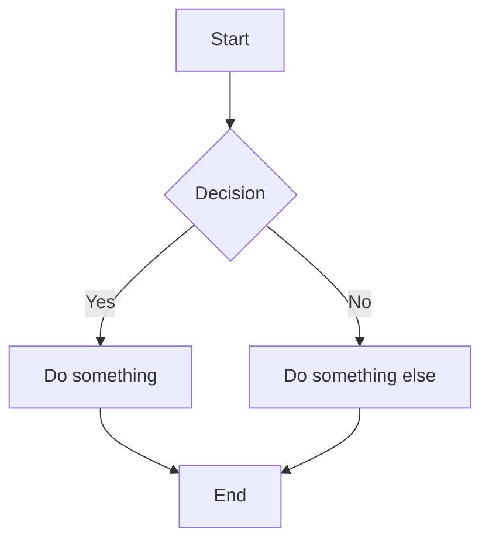
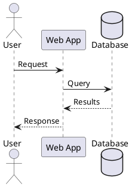
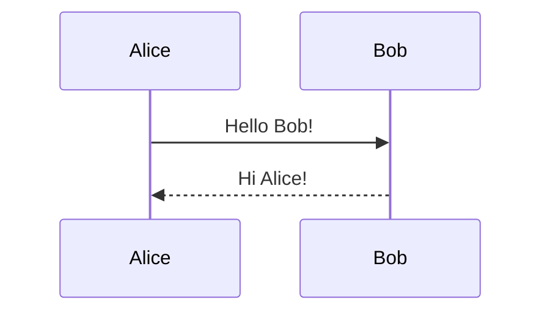

# Embedded Diagram Test

This page tests inline diagram rendering in markdown.

Foo!

## Mermaid Diagram



## PlantUML Diagram



## Regular Code Block

```javascript
// This should still render as syntax-highlighted code
function hello() {
  console.log('Hello, world!');
}
```

## Mixed Content

Some text before a diagram.



And some text after.
